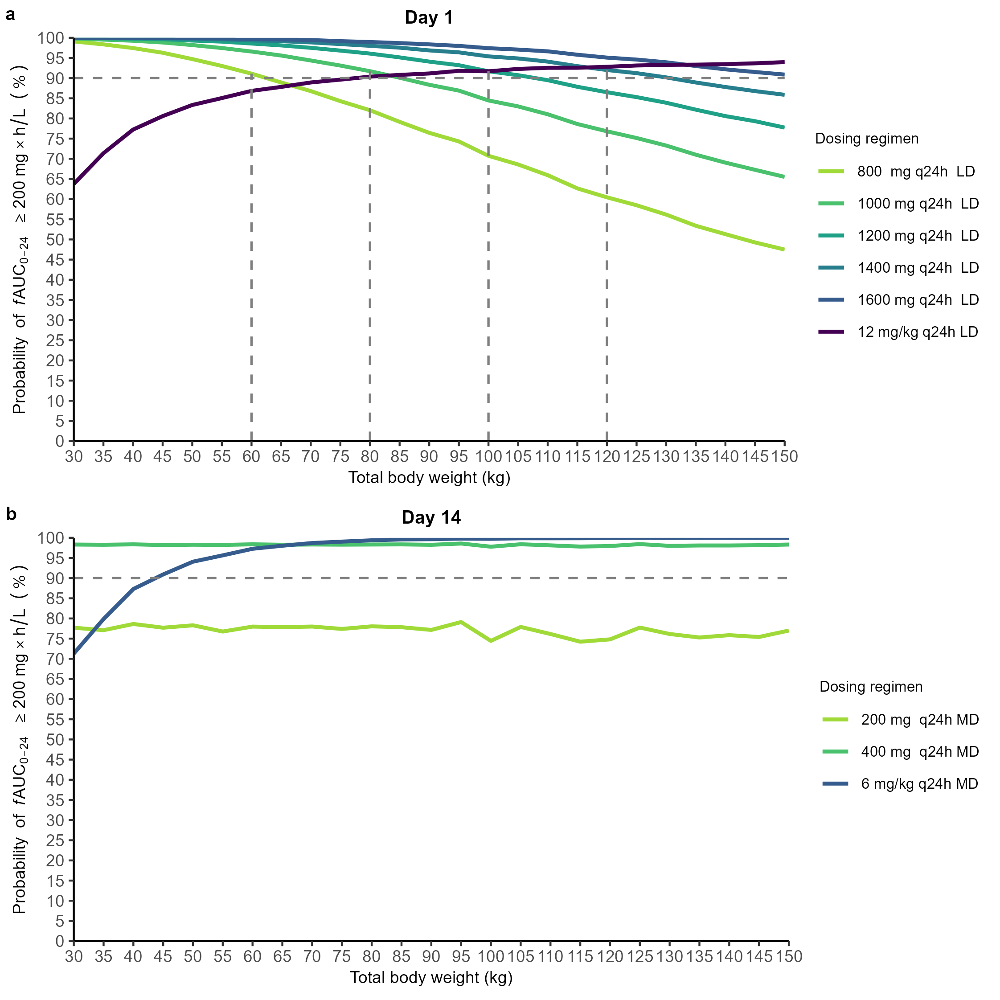
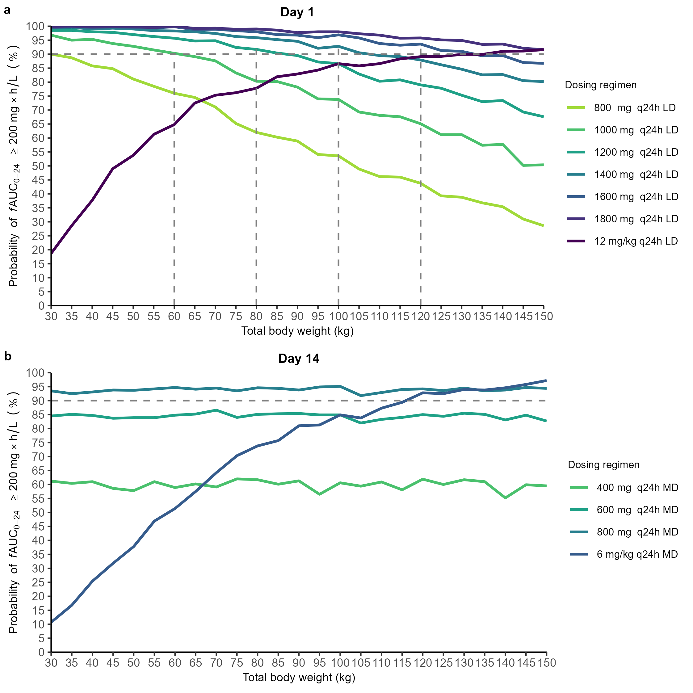
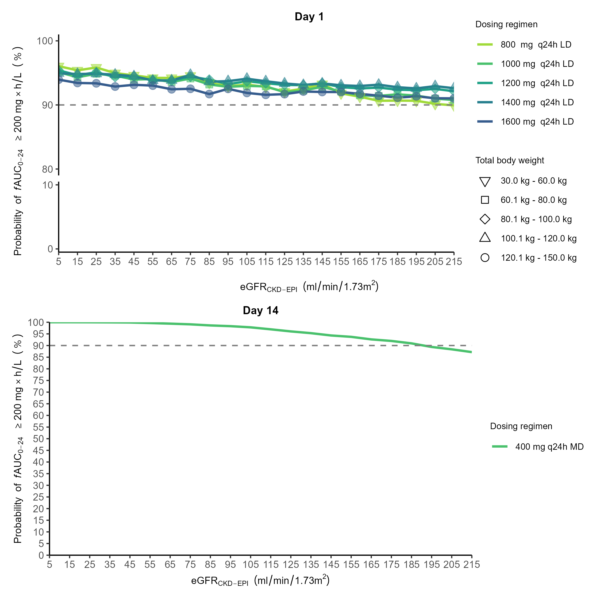
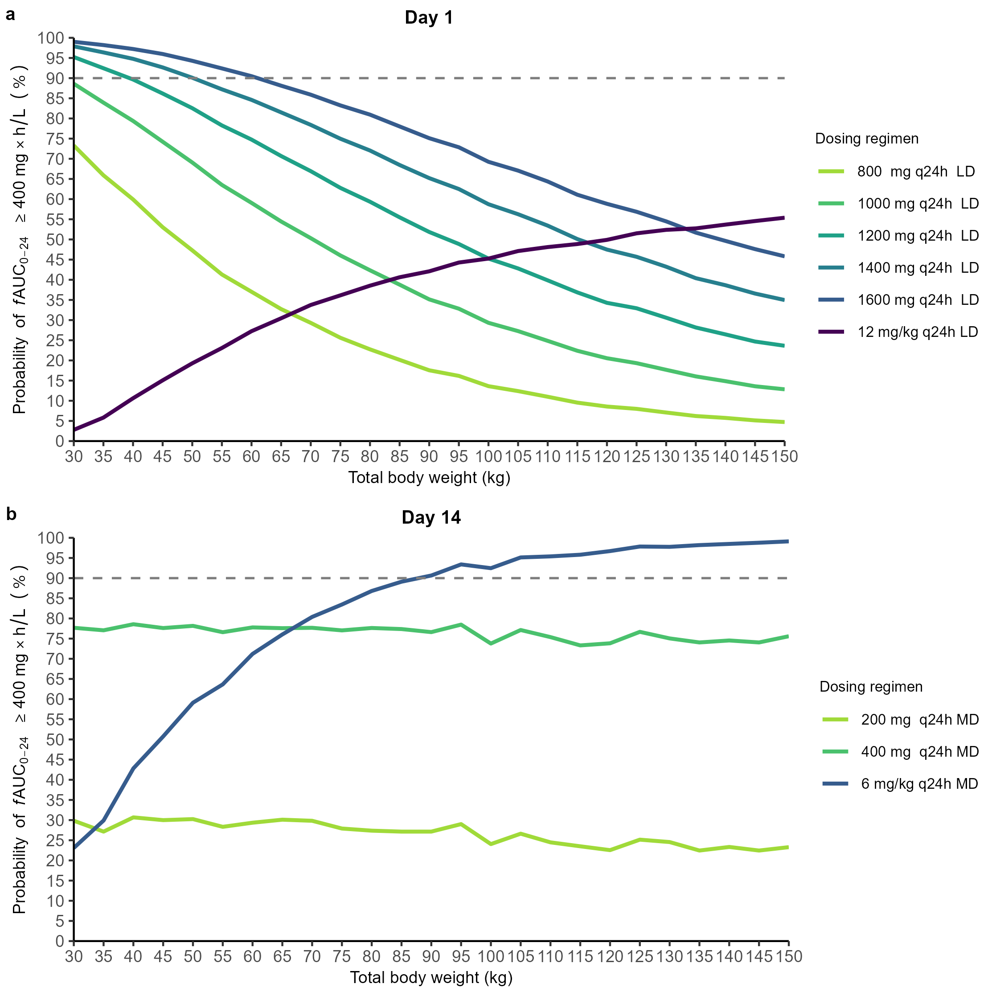
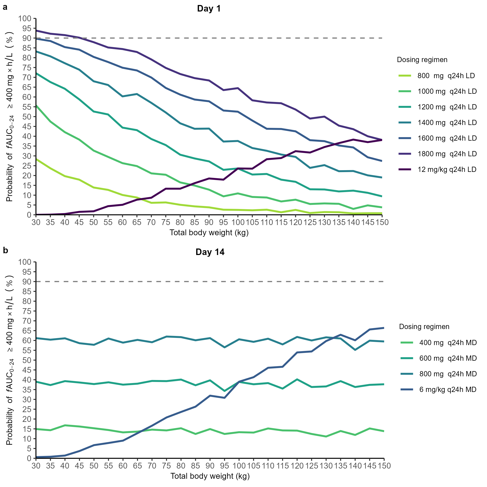
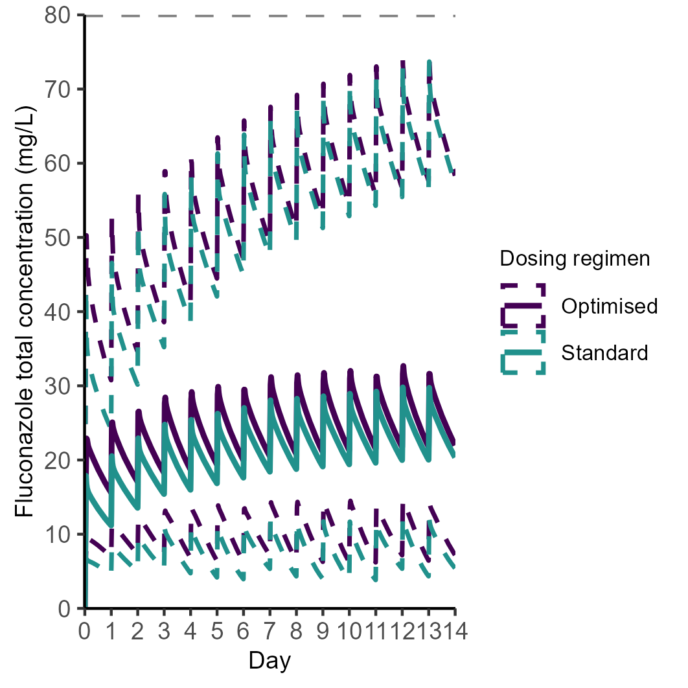

```{r}
#| label: setup
#| include: false
#| warning: false
knitr::opts_chunk$set(echo = TRUE)
library(dplyr)
library(here)
library(flextable)
library(ftExtra)
library(equatags)
fig_dir <- here("../checklist-ijaa/Artwork/figures+captions")
```

## Introduction {#sec-intro}

Invasive candidiasis, including candidaemia, remains a serious complication that most frequently occurs in patients who are immunocompromised, have undergone (abdominal) surgery, or are critically ill [@cornely2012]. In patients admitted to the intensive care unit (ICU), candidaemia is associated with a crude mortality rate of 42% to 47% [@schroeder2020; @bassetti2019; @sbrana2018].

Fluconazole is a triazole antifungal drug used for treating invasive candidiasis and candidaemia [@pfizer2012diflucan]. It is recommended as a step-down therapy from echinocandins for candidaemia caused by fluconazole-susceptible *Candida* species [@pappas2015]. In clinical practice, fluconazole is frequently administered because of its safety profile, satisfactory tissue penetration, and low cost compared with other antifungal agents [@pappas2015; @rubio-rodríguez2015]. Fluconazole is primarily excreted unchanged by the kidney (\~80%), undergoing glomerular filtration and active tubular reabsorption [@pfizer2012diflucan]. Hepatic metabolism is minimal, with only 11% of the dose excreted as metabolites via the kidneys [@pfizer2012diflucan]. Protein binding is low (11--12%) [@pfizer2012diflucan].

The primary pharmacokinetic--pharmacodynamic (PKPD) target of fluconazole is a ratio of the area under the unbound concentration-time curve for 24 hours over the minimum inhibitory concentration (*f*AUC~0-24~/MIC) of 100 [@eucast2020fluconazole]. This corresponds to an *f*AUC~0-24~ of 200 mg×h/L for a MIC of 2 mg/L, which is the non-species-related susceptibility breakpoint for *Candida* [8]. Fluconazole-induced hepatotoxicity was documented in a case study, but there is no evidence of concentration-dependent hepatotoxicity of fluconazole [@jacobson1994]. Nevertheless, concentration-dependent toxicity related to fluconazole was documented in two case reports of patients developing clonic convulsions at a trough concentration (C~trough~) of approximately 80 mg/L [@matsumoto2000; @lewis2015triazoletdm].

The manufacturer-recommended fluconazole dosing regimen for invasive candidiasis is an 800 mg loading dose on day 1, followed by a 400 mg daily maintenance dose from day 2 [@pfizer2012diflucan]. Additionally, a consensus of expert panels suggested a loading dose of 12 mg/kg followed by a maintenance dose of 6 mg/kg for ICU patients [@abdul-aziz2020]. Using the recommended dosing regimen, attainment of the PKPD target in patients admitted to the ICU is often inadequate or delayed, particularly in those who are overweight or undergoing continuous renal replacement therapy (CRRT) [@Sandaradura2021; @boonstra2021; @muilwijk2020]. Furthermore, several population pharmacokinetics (popPK) studies performed in this vulnerable patient population showed conflicting results regarding an optimised fluconazole dosing strategy [@Sandaradura2021; @boonstra2021; @muilwijk2020; @alobaid2016]. This could be attributed to the single-centre nature and low number of patients included in these reports.

Therefore, we performed a population pharmacokinetics analysis using data from eight published studies collected from patients receiving intravenous (IV) fluconazole. We aimed to (i) identify covariates with a clinically relevant impact on fluconazole *f*AUC~0-24~ target attainment and (ii) provide an optimised dosing recommendation ensuring adequate, ICU-wide target attainment.

## Material and methods {#sec-methods}

### Patient population and study design {#study-design}

We identified studies reporting the plasma concentrations of IV fluconazole in patients admitted to the ICU through a literature search (PubMed) from inception to October 2022. We then contacted the authors to arrange the individual concentration-time data transfer upon contractual agreement. Next, we aggregated datasets for analysis. The study was approved by the Ethics Committee Research UZ / KU Leuven (S62242). Written informed consent for the secondary use of prospectively collected data was obtained from participants of the original studies in compliance with the approval of the (local) Ethics Committees.

### Population pharmacokinetics modelling {#poppk-modelling}

We developed a popPK model from the aggregated dataset to describe the fluconazole concentration-time data. One-, two-, and three-compartment models with linear elimination processes were explored. The magnitude of differences in individual PK parameters from the typical value (i.e., interindividual variability) and differences between observed and model-predicted individual concentrations (i.e., residual variability) were estimated. The variability between occasions within the same individual (inter-occasion variability) was tested with two occasions defined as ≤day 7 and \>day 7. We tested between-centre variability as a random effect and a fixed effect. The difference in analytical assays used among centres was tested by introducing different error models for each assay. Individual PK parameters were assumed to be log-normally distributed, which was achieved by using an exponential function. For example, the volume of distribution in the central compartment of subject *i* ($Vc_i$) was calculated following this equation:

$$
Vc_i = Vc_{pop} \times \exp(\eta_i)
\quad \text{with} \quad
\eta_i \sim N(0, \omega^2)
$$ {#eq-vc-i}

with $Vc_{pop}$ the typical population value of $Vc$, $\eta_i$ the deviation of the individual from the typical population value assuming a log-normal distribution, and $\omega^2$ the variance of all $\eta_i$.

A final model including covariate effects was built through stepwise covariate modelling ($\alpha_{\text{forward}} = 0.05$, $\alpha_{\text{backward}} = 0.01$) [@mould2013; @jonsson1998]. We assessed the covariates that are physiologically relevant to fluconazole PK. These included total body weight, body mass index (BMI), fat-free mass (FFM) at baseline (day of ICU admission), and time-varying CRRT (yes/no) and estimated glomerular filtration rate (eGFR). Among these covariates, FFM was approximated by lean body weight derived from total body weight and height [@boer1984], while eGFR was calculated using the Chronic Kidney Disease Epidemiology Collaboration (CKD-EPI) equation without race [@sharma2021].

Continuous covariates (total body weight, BMI, FFM, and $eGFR_{CKD-EPI}$) were normalised to the median value in the population and introduced into the popPK model using a power function [@mould2013], exemplified as follows:

$$
Vc_i = Vc_{pop} \times \left( \frac{BW_i}{80\ \text{kg}} \right)^{BW\_EFF} \times \exp(\eta_i)
\quad \text{with} \quad
\eta_i \sim N(0, \omega^2)
$$ {#eq-vc-i-bweff}

with BW_EFF the effect of body weight on $Vc_i$ and the patient's total body weight was normalised to the population median value of 80 kg.

### Missing data handling {#missing-data}

When at least one value of a variable was available in a dosing interval, we imputed the mean of the available value(s) in that dosing interval. When no value of a variable was available in a dosing interval, we employed multiple imputation, which has been shown to better reflect the uncertainty of the parameter estimate for the missing variable compared to single imputation [@Vuong2025]. Specifically, we built a multiple imputation model including variables that were in the aggregated dataset. We used two multiple imputation techniques, the two-level method using a linear mixed model, and the predictive mean matching method when missingness was \>5% and ≤5%, respectively [@vanbuuren2018flexible]. We replaced the negative imputed values of a variable with the lowest value of that variable observed in the dataset. Multiply imputed datasets were created, and independent popPK analyses were conducted for each dataset. Results were then combined using Rubin's rules for normally distributed parameter estimates [@vanbuuren2018flexible]. For non-normal, non-negative variance terms, log transformation was performed before pooling estimates to ensure the normality assumption holds [@vanbuuren2018flexible]. The delta method was used to obtain the variance of these log-transformed terms [@hosmer2008applied]. The number of imputations was chosen based on the magnitude of the missingness of the specific variable [@vanbuuren2018flexible]. The 95% confidence interval of the pooled estimates, which follow the Student's t-distribution, was calculated [@vanbuuren2018flexible].

### Model selection and evaluation {#mod-selection}

We selected the most parsimonious popPK model based on a likelihood ratio test with a 5% significance level (delta objective function value ≥3.84 points, 1 degree of freedom), parameter precision (95% confidence interval), and physiological plausibility of the parameter estimates. Additionally, we used goodness-of-fit plots, including population and individual predictions versus observations, conditional weighted residuals versus time and versus population predictions, and prediction-corrected visual predictive check (pcVPC) plots (n = 1000 simulations) [@mould2013]. We used bootstrapping to acquire non-parametric estimates of uncertainty in parameter estimates (n = 2000 bootstraps) [@mould2013].

### Simulations {#simulations}

#### Dose-finding simulations {#dose-finding}

**Selecting dosing regimens for testing**

We conducted Monte Carlo simulations using the final popPK model to evaluate various fluconazole dosing regimens. These regimens were selected based on the manufacturer's recommended standard loading and maintenance doses (800 mg on day one, then 400 mg daily) as a reference for comparison. Dose increments were based on the commercially available fluconazole IV dosage forms of 200 and 400 mg to avoid drug waste [@pfizer2012diflucan]. Considering a 200 mg increment in doses, we evaluated six loading doses ranging from 800 to 1800 mg on day 1 and three maintenance doses ranging from 400 to 800 mg daily. We also tested total body weight-based dosing (12 mg/kg on day 1, followed by 6 mg/kg daily), as suggested previously [@alobaid2016].

**Creating virtual patient datasets**

Virtual patients were defined exclusively by the covariates retained in the final popPK model (**Supplementary Table**). Correlation between the covariates was maintained similarly to that in the aggregated dataset. A total of 1000 simulations were performed per virtual patient.

**Criteria for evaluating dosing regimens**

A dosing regimen was considered acceptable if it achieved a 90% probability of target attainment (PTA) across the population [@chmp2016pkpd]. The adequacy of the loading dose was evaluated via the PTA 24 hours after its administration (day 1). Similarly, the adequacy of the maintenance dose was evaluated via the PTA on day 14 [@jacobson1994]. The sufficiency of the resulting dosing regimen throughout the entire 2-week treatment period was then confirmed via its PTA on days 2 and 7.

#### Real-world population simulations {#pop-sim}

The 14-day standard and optimised dosing regimens were compared for population-level PTA and drug exposure. Therefore, we created a virtual patient population of 1000 patients to represent the real-world population in our aggregated dataset, ensuring the proportions of categorical covariates and distributions of continuous covariates matched. Specifically, we randomly sampled continuous covariates from their empirical cumulative distribution functions obtained from the aggregated dataset [@ramachandran2021statest]. 1000 simulations were also performed per virtual patient.

### Software {#software}

Dataset formatting and exploration were performed using R (v4.3.3; R Core Team, Vienna, Austria) in the RStudio integrated development environment (v 2024.04.0+735; RStudio, Inc., Boston, MA, USA). We used the *tidyverse* collection of packages for this purpose, while using the mice package to perform multiple imputation [@vanbuuren2018flexible; @wickham2023r4ds]. NONMEM (v7.5.0; ICON Development Solutions, Gaithersburg, MD, USA) with differential equation solver ADVAN13 and the first-order conditional estimation with interaction method for parameter estimation was used for nonlinear mixed-effects modelling. All procedures were executed using the Perl-speaks-NONMEM (PsN; v5.3.0) toolkit on the Pirana modelling workbench (v21.11.1; Certara, Inc., Princeton, NJ, USA) [@keizer2013]. The NONMEM control stream is available in the **Supplementary Code**.

## Results {#sec-results}

### Data {#results-data}

Data from eight studies included 177 ICU patients treated with IV fluconazole [@Sandaradura2021; @boonstra2021; @muilwijk2020; @alobaid2016; @bergner2005; @buijk2001; @sinnollareddy2015; @vandaele2021]. Patient characteristics are summarised in Table  \ref{tbl-pt-character}. Patients contributed 1616 total fluconazole plasma concentrations, with a median of seven concentrations per patient. None of the concentrations were below the lower limit of quantification. Total body weight at ICU admission ranged from 34 kg to 142 kg, eGFR~CKD-EPI~ when not undergoing CRRT ranged from 7 mL/min/1.73 m2 to 213 mL/min/1.73 m^2^. Total body weight was missing in 2.8% of the cohort. CRRT status was available for all patients, of whom 19.2% received CRRT at least once during their treatment period. An eGFR~CKD-EPI~ was available only in 40.7% of the dosing intervals. Missing eGFR~CKD-EPI~ data were handled with multiple imputation at the dosing interval level, while missing total body weight data were handled at the patient level (*m* = 70 multiply imputed datasets). Multiple imputation performance is shown in **Figs. S1-S2**. The concentration-time courses for the per-centre and pooled datasets are shown in **Figs. S3-S4**.

### Population pharmacokinetics modelling {#results-modelling}

A two-compartment popPK model with linear elimination best described the fluconazole concentration-time data (**Table 2**). Fluconazole clearance was estimated separately when a patient was on CRRT (CL~on-CRRT~; 1.56 L/h \[10.2% relative standard error; RSE\]) and when off CRRT (CL~off-CRRT~; 0.633 L/h \[5.4% RSE\]). Interindividual variability was estimated on CL~on-CRRT~, CL~off-CRRT~, and Vc, with a covariance relationship between CL~off-CRRT~ and Vc of 33.9%. A proportional error model best described the residual variability. Different analytical assays did not significantly impact the error model. The per-centre and overall goodness-of-fit plots are available in **Figs. S5-S9**.

The inclusion of the effects of baseline total body weight on Vc and time-varying eGFR~CKD-EPI~ on CL~off-CRRT~ significantly improved the goodness-of-fit of the popPK model. The pooled parameter estimates of the 70 multiply imputed models and the medians of 10 random bootstrap results (2000 bootstraps in total) are available in **Table 2**. Equations 3 and 4 demonstrate how fluconazole Vc and CL~off-CRRT~ of patient *i* increase with total body weight and eGFR~CKD-EPI~, respectively:

$$
Vc_i = 39.4\ \text{L} \times 
\left( \frac{BW_i}{80\ \text{kg}} \right)^{0.908}
\times \exp(\eta_i)
\quad \text{with} \quad
\eta_i \sim N(0,\ 0.312)
$$

$$
CL_{\text{off-CRRT},\,i} = 0.614\ \text{L} \times
\left( \frac{eGFR_{\text{CKD-EPI},\,i}}{80\ \text{mL}/\text{min}/1.73\ \text{m}^2} \right)^{0.532}
\times \exp(\eta_i)
\quad \text{with} \quad
\eta_i \sim N(0,\ 0.217)
$$

Body weight and eGFR~CKD-EPI~ explained 7.1% and 8.1% of the interindividual variability in Vc and CL~off-CRRT~ of fluconazole, respectively. The unexplained interindividual variability in Vc and CL~off-CRRT~ remained high, i.e., 60.5% and 49.3%, respectively.

The per-centre and pooled data pcVPC plots show a good agreement between model simulations and observed data (**Figs. S10-S11**). The pcVPC stratified by CRRT status is available in **Fig. S12**. Median values of the non-parametric bootstrap were in good agreement with the pooled point estimates (**Table 2**).

### Simulations {#results-sim}

The standard loading dose did not result in clinically acceptable PTA of ≥90% when total body weight exceeded 60 kg and 30 kg, in patients off and on CRRT, respectively. Similarly, the weight-based regimen (12 mg/kg loading dose) failed to achieve adequate PTA in patients weighing less than 80 kg without CRRT and less than 120 kg with CRRT (**panel a, Figs. 1-2**). The statistically significant effect of eGFR~CKD-EPI~ on CL~off-CRRT~ did not have a clinically relevant impact on fluconazole *f*AUC~0-24~ 200 mg×h/L target attainment across the eGFR~CKD-EPI~ range of 5 to 215 mL/min/1.73 m² under simulated loading doses. Moreover, using the standard maintenance dose of 400 mg, the PTA only fell slightly below 90% when eGFR~CKD-EPI~ exceeded 195 mL/min/1.73 m2 (**Fig. 3**). **Figs. 4-5** shows the probability of attaining the *f*AUC~0-24~ 400 mg×h/L target versus total body weight for the simulated dosing regimens.

The optimised stratified dosing regimen is presented in **Table 3**. The proposed loading dose was determined based on the patient's total body weight and CRRT status. The selected doses were the smallest that ensured a clinically acceptable PTA 24 hours after administration. Daily maintenance doses of 400 mg and 800 mg were adequate for achieving at least 90% PTA across the studied total body weight range, off and on CRRT, respectively (**Figs. 1-2, Figs. S13-S14**).

Real-world population simulations confirmed that the standard dosing regimen of 800 mg on day 1 followed by 400 mg thereafter did not achieve 90% PTA in the first two days, but improved to a \>90% PTA from day 3 of the treatment period (**Fig. S15**). Simulation of the optimised dosing regimen resulted in \>90% PTA as early as day 1 up to day 14 of treatment (**Fig. 6, Fig. S15**). Less than 1.2% of patients had fluconazole C~trough~ of 80 mg/L or higher across the two-week treatment period. The characteristics of the real-world virtual population are shown in **Figs. S16-S17**. The R code and dataset used to generate this population are in the **Supplementary Code** and **Supplementary Dataset**.

## Discussion {#sec-discuss}

Our modelling and simulation results showed that total body weight and CRRT status were the two factors that clinically impacted the attainment of the *f*AUC~0-24~ 200 mg×h/L target in critically ill patients under the standard fluconazole IV dosing regimen. Therefore, we proposed a pragmatic, optimised dosing regimen that could achieve a PTA of at least 90% over the entire two-week treatment course.

The PK of fluconazole in critically ill patients was best described by a two-compartment model with first-order elimination, consistent with studies that employed a rich-sampling technique [@muilwijk2020; @alobaid2016; @patel2011]. In contrast, several studies that relied on (trough) samples collected during routine clinical practice identified a one-compartment model [@Sandaradura2021; @boonstra2021; @aoyama2011]. This disparity can be attributed to the sparse sampling in clinical practice, which limits the ability to fit a two-compartment model. Total body weight not only significantly influenced Vc, but it also had a clinically relevant impact on target attainment under the standard dosing regimen (800 mg loading dose and 400 mg maintenance dose). Specifically, a higher total body weight was associated with a lower PTA following the loading dose of 800 mg. This finding aligns with previous popPK studies, which reported that obesity is a risk factor for suboptimal exposure to fluconazole [@Sandaradura2021; @alobaid2016; @chen2022]. Although FFM may be a better surrogate for Vc of fluconazole, we found that total body weight improved the model fit the most. Furthermore, total body weight is preferred over BMI and FFM in clinical practice as it does not require guessing the patient's height [@boer1984]. Fluconazole clearance was nearly three times higher when patients were on CRRT than when they were off CRRT. This accelerated on-CRRT clearance may be explained by the absence of tubular reabsorption in anuric patients, as fluconazole is extensively reabsorbed when kidney function is normal [@patel2011]. Additionally, eGFR~CKD-EPI~ significantly impacted CL~off-CRRT~ in our model, which aligns with fluconazole's primary renal clearance [@pfizer2012diflucan]. We chose the eGFR~CKD-EPI~ equation without race as the sole method for assessing kidney function because it is more accurate than equations like Cockcroft-Gault and performs better than the equation that includes race [@sharma2021].

We demonstrated that eGFR~CKD-EPI~ had no clinically relevant impact on PKPD target attainment under the proposed optimised dosing regimen; thus, our dosing recommendations were not based on renal function. Despite significantly improving the goodness-of-fit of the popPK model, eGFR~CKD-EPI~ did not affect PTA across its entire range with this optimised regimen. Our recommended maintenance dose for patients not undergoing CRRT was 400 mg q24h, aligning with the current standard. Although our simulation showed a slight decrease below the 90% PTA with this dose in patients with eGFR~CKD-EPI~ above 195 mL/min/1.73 m², we did not recommend increasing it, as this minor reduction was based on the unlikely assumption that eGFR~CKD-EPI~ would remain consistently above 195 mL/min/1.73 m² for 14 days. Huang et al. recently reported that kidney function is highly unstable in ICU patients [@huang2022].

Our study's finding of no effect from kidney function contrasts with previous research, which suggested that increased doses are needed for patients with augmented renal clearance [@Sandaradura2021; @muilwijk2020]. This discrepancy probably reflects bias caused by inadequate missing data handling techniques. Unlike previous studies, we used multiple imputation, which is a superior method to single imputation or complete case analysis, especially when data is missing at random [@Vuong2025]. Unfortunately, despite significant evidence to the contrary, single imputation remains widely applied in pharmacometrics research. Such a method would falsely decrease the temporal variability in eGFR~CKD-EPI~ that we observed during critical illness [@huang2022]. Multiple imputation fills in the missing data multiple times with many different plausible values, thereby accounting for the variability [@vanbuuren2018flexible]. Although we could not identify a clinically relevant effect of eGFR~CKD-EPI~ on PKPD target attainment, this should not be interpreted as a confirmation of the absence of a kidney function effect, but rather as a failure to confirm an effect with the current dataset. Therefore, a well-designed, prospective clinical trial with an intensive data collection scheme is necessary to validate our findings.

Our proposed dosing regimen may avoid the need to conduct TDM after being successfully confirmed in a future trial. TDM of fluconazole is not widely recommended nor implemented, but is advocated in rare circumstances such as for obese patients, patients on CRRT, and patients with sepsis [@lewis2015triazoletdm]. However, fluconazole TDM is not always available, and when available, turnaround time and costs might hamper the feasibility of routine implementation [@sandaradura2021-second]. Therefore, the implementation of our recommended dosing regimen based on total body weight and CRRT status may potentially deliver personalised dosing of fluconazole whilst simultaneously simplifying workflows. Nevertheless, in clinical centres where neither drug cost nor integration of automated dose calculation in prescribing software tools is of concern, other dosing strategies and the availability of TDM may be considered.

It is worth noting that our recommended loading dose is not the lowest effective dose. Specifically, since there are challenges in accurately measuring the total body weight of patients confined to their beds in the ICU setting, we incorporated a precautionary measure of accounting for \~5--10 kg underestimation in total body weight [@darnis2012].

Our simulations also demonstrated the proposed regimen to be potentially safe (\<1.2% risk of Ctrough ≥80 mg/L). As such, it is appropriate for introduction into ICUs worldwide to treat patients infected with Candida species with MIC ≤2 mg/L after being locally evaluated. However, for "susceptible, increased exposure" non--*Candia glabrata* species (MIC of 4 mg/L), our recommended regimen showed a poor target attainment, necessitating a much higher dose. The same applies to *C. glabrata* species with MICs up to 16 mg/L. Dose optimisation of fluconazole considering these MICs raises safety concerns, as the percentage of patients having Ctrough ≥80 mg/L will be much higher.

Unlike the label, we did not recommend a reduction of the loading or maintenance doses for patients with renal impairment (i.e., creatinine clearance ≤50 mL/min) [@pfizer2012diflucan]. While fluconazole is generally well tolerated, it may cause hepatotoxicity and QT prolongation on an electrocardiogram, posing a risk of life-threatening arrhythmias [@pfizer2012diflucan]. Therefore, future prospective studies should assess the safety profile of our proposed dosing regimen.

We acknowledge several limitations in our study. First, we did not conduct a systematic search to identify eligible studies in the literature; thus, we might not have included all the published study data [@vanwijk2023]. The resource-intensive and time-consuming process of contacting authors, obtaining data, and preparing datasets may not always outweigh the benefits and should be seriously considered before initiation [@vanwijk2023]. Nevertheless, we generated the largest IV fluconazole PK dataset in ICU patients to date. Second, we could not differentiate between types of CRRT, as this information was not fully recorded in our dataset. Each CRRT type has different implications for fluconazole elimination and could require different dosing strategies [@li2020]. Nevertheless, we would not likely be able to determine the impact of CRRT types due to the limited representation of CRRT in our dataset, with only 19.2% of patients having at least one CRRT session. Third, our study integrates data from eight different studies, which increases the sample size but may introduce heterogeneity. Variations in patient selection, sampling times, and analytical methods across these studies could affect data consistency and the reliability of the results. For example, the recording of CRRT types and parameters may not have been consistent across studies. Fourth, we did not explore potential interaction terms between covariates in our model, which may improve model fit [@zwep2024interaction]. Fifth, although the study set *f*AUC₀₋₂₄/MIC = 100 as the target, MIC values can vary significantly across strains in clinical settings, which may limit the practical relevance of the target attainment rate. For strains with higher MICs (e.g., 4 mg/L), the proposed dosing regimen may be insufficient to achieve the desired exposure. Sixth, although our study proposes an optimised dosing regimen based on total body weight and CRRT status, frequent dose adjustments may be difficult to implement in clinical practice, particularly in ICU settings, where patients' conditions and physiological parameters can change rapidly. Seventh, we applied the CKD-EPI equation to estimate the eGFR, of which the reliability remains questionable in critically ill patients [@gijsen2020]. However, this is a general problem applicable to all eGFR estimates, and CKD-EPI has been shown to be the least worst [@gijsen2020]. Finally, our studied population may not be representative of, and thus our study results may not be extrapolated to other patient populations. To address this issue, we included the model code in the Supplementary file, and we encourage other data owners to externally evaluate our model with their populations.

In conclusion, our popPK analysis identified total body weight and CRRT status as clinically relevant factors impacting fluconazole *f*AUC~0-24~ target attainment in critically ill patients under the standard dosing regimen. We proposed a stratified fluconazole dosing regimen based on these two factors to potentially ensure an ICU-wide PKPD target attainment. A prospective clinical trial with more intensive data collection is necessary to provide robust evidence supporting our optimised fluconazole dosing recommendation.

## Statements and Declarations {.unnumbered}

### Funding {.unnumbered}

My-Luong Vuong is supported by a doctoral research grant from the Research Foundation -- Flanders (FWO), Belgium (grant number: 1SH6A24N). Isabel Spriet is supported by the Clinical Research Fund, University Hospitals Leuven, Belgium.

### Competing Interests {.unnumbered}

Ruth Van Daele contributed to this work while employed at KU Leuven and UZ Leuven. She is currently employed at Gilead Sciences.

Jan-Willem C. Alffenaar is a consultant for WHO and has received an honorarium from Pfizer for unrestricted educational activities.

Jason A. Roberts reported receiving personal fees from Qpex, Gilead, Advanz Pharma, Pfizer, Sandoz, MSD, Cipla, and bioMerieux, and grants from Qpex, Pfizer, bioMerieux, and the British Society for Antimicrobial Chemotherapy, Additionally, he was supported by a Leadership Fellowship from the National Health and Medical Research Council of Australia and an Advancing Queensland Clinical Fellowship. He is also a recipient of a Centre of Research Excellence from the National Health and Medical Research Council of Australia.

Yves Debaveye reports travel support from Pfizer and participation in advisory boards of Pfizer and MSD.

Joost Wauters reports investigator-initiated grants from Pfizer, Gilead, and MSD; consulting fees from Pfizer and Gilead; speakers' fees from Pfizer, Gilead, and MSD; travel fees from Pfizer, Gilead, and MSD; participation in advisory boards of Pfizer and Gilead; receipt of study drugs from MSD.

Roger J. Brüggemann reports consultancy fees from Mundipharma, Cidara, Amplyx, F2G, Gilead, Pfizer, and MSD, speaker fees from Pfizer and Gilead; grants from Pfizer, Gilead, and MSD.

Jeroen A. Schouten reports unrestricted educational grants from MSD and Biomerieux.

Raoul Bergner has received speaker fees from Abbvie, BMS, Chugai, Galapagos, GSK, Janssen-Cilag, Lilly, MSD, Novartis, Vifor, and participation in advisory boards Abbvie, GSK, Vifor.

Isabel Spriet is supported by the Clinical Research Fund of UZ Leuven and reports consulting fees from Pfizer and Cidara; speakers' fees from Pfizer; travel support from Pfizer.

Erwin Dreesen received consultancy fees from Alimentiv and argenx; lecture fees from Celltrion and Galapagos; and financial support from Celltrion, Janssen, Pfizer, Prometheus, R-Biopharm, and Sandoz outside the submitted work, with all honoraria/fees being paid to KU Leuven and not to any personal account of Erwin Dreesen.

My-Luong Vuong, Omar Elkayal, Sophie L. Stocker, Beatrijs Mertens, Jasper M. Boonstra, Indy Sandaradura, Deborah J.E. Marriott, and Steven Buijk declared no conflict of interest.

### Ethics approval {.unnumbered}

The study was approved by the Ethics Committee Research UZ / KU Leuven (S62242).

### Consent to participate {.unnumbered}

Written informed consent for the secondary use of prospectively collected data was obtained from participants of the original studies in compliance with the approval of the (local) Ethics Committees \ref{tbl-pt-character}.

## Tables {.unnumbered}

::: landscape
```{=latex}
\begin{table}[htbp]
\centering
\caption{Patient characteristics}
\label{tbl-pt-character}
\fontsize{8}{11}\selectfont

\begin{threeparttable}
\setlength{\tabcolsep}{2pt}
\renewcommand{\arraystretch}{1.1}
\begin{tabularx}{\linewidth}{p{3.4cm} *{9}{>{\raggedright\arraybackslash}X}}
\toprule
\textbf{Parameter} &
\begin{tabular}[t]{@{}l@{}}Van Daele\\ et al.\\ (n = 39)\\ \cite{vandaele2021}\end{tabular} &
\begin{tabular}[t]{@{}l@{}}Muilwijk\\ et al.\\ (n = 19)\\ \cite{muilwijk2020}\end{tabular} &
\begin{tabular}[t]{@{}l@{}}Bergner\\ et al.\\ (n = 5)\\ \cite{bergner2005}\end{tabular} &
\begin{tabular}[t]{@{}l@{}}Buijk\\ et al.\\ (n = 5)\\ \cite{buijk2001}\end{tabular} &
\begin{tabular}[t]{@{}l@{}}Sandaradura\\ et al.\\ (n = 30)\\ \cite{Sandaradura2021}\end{tabular} &
\begin{tabular}[t]{@{}l@{}}Sinnollareddy\\ et al.\\ (n = 25)\\ \cite{sinnollareddy2015}\end{tabular} &
\begin{tabular}[t]{@{}l@{}}Alobaid\\ et al.\\ (n = 21)\\ \cite{alobaid2016}\end{tabular} &
\begin{tabular}[t]{@{}l@{}}Boonstra\\ et al.\\ (n = 33)\\ \cite{boonstra2021}\end{tabular} &
\begin{tabular}[t]{@{}l@{}}Overall\\ (n = 177)\end{tabular} \\
\midrule

APACHE II, median [Q1–Q3] &
16.0 [14.0–22.0] & 18.0 [15.0–23.0] & NA & NA & NA &
22.0 [12.0–33.0] & 18.0 [17.0–21.0] & 19.0 [14.0–20.0] & 18.0 [15.0–23.0] \\

\quad Missing, n (\%) &
2 (5.1) & 0 (0) & 5 (100) & 5 (100) & 30 (100) &
0 (0) & 0 (0) & 6 (18.2) & 48 (27.1) \\

Age, median [Q1–Q3], years &
65.0 [57.5–70.0] & 64.0 [52.5–70.5] & 57.0 [43.0–67.0] &
53.0 [48.0–56.0] & 55.0 [44.0–66.5] &
64.0 [53.0–78.0] & 52.0 [48.0–65.0] & 60.0 [54.0–72.0] & 62.0 [50.0–70.0] \\

Body weight, median [Q1–Q3], kg &
72.0 [63.5–86.5] & 82.0 [73.0–96.5] & NA &
72.0 [65.0–80.0] & 80.0 [61.0–98.5] &
80.0 [75.0–90.0] & 85.0 [74.0–103] & 80.0 [72.0–90.0] & 80.0 [70.0–92.0] \\

\quad Missing, n (\%) &
0 (0) & 0 (0) & 5 (100) & 0 (0) & 0 (0) &
0 (0) & 0 (0) & 0 (0) & 5 (2.8) \\

Sex, male, n (\%) &
26 (66.7) & 11 (57.9) & 1 (20.0) & 3 (60.0) &
18 (60.0) & 19 (76.0) & 11 (52.4) & 26 (78.8) & 115 (65.0) \\

CRRT, n (\%) &
8 (20.5) & 6 (31.6) & 5 (100) & 0 (0) &
10 (33.3) & 5 (12.0) & 0 (0) & 0 (0) & 34 (19.2) \\

Total dosing and sampling events &
709 & 496 & 174 & 76 & 451 & 261 & 249 & 755 & 3170 \\

\quad Fluconazole dose, median [Q1–Q3], mg, N &
400 [400–400], 453 & 400 [200–400], 182 & 800 [800–800], 90 &
400 [400–400], 33 & 400 [400–400], 321 &
400 [300–400], 192 & 400 [400–400], 89 &
400 [200–400], 194 & 400 [400–400], 1554 \\

\quad Plasma samples available per patient, median [Q1–Q3], N &
6 [3–8], 256 & 18 [12–19], 314 & 18 [8–25], 84 &
7 [7–7], 42 & 3.50 [3.00–5.75], 130 &
3 [3–3], 69 & 8 [7–8], 160 & 14 [7–22], 561 & 7 [3–12], 1616 \\

\quad eGFR$_{\text{CKD-EPI}}$, median [Q1–Q3], mL/min/1.73 m$^2$ &
85.5 [46.9–105] & 93.1 [60.3–105] & NA & NA &
67.7 [46.6–100] & 73.3 [25.5–110] & 101 [72.9–120] &
98.3 [71.9–111] & 82.7 [49.8–104] \\

\quad Missing within dosing intervals, N (\%) &
254 (35.8) & 231 (46.6) & 0 & 0 & 82 (18.2) &
15 (5.7) & 6 (2.4) & 104 (13.8) & 692 (21.8) \\

\quad Missing between dosing intervals, N (\%) &
199 (28.1) & 215 (43.3) & 174 (100) & 75 (100) &
156 (34.6) & 221 (84.7) & 222 (89.2) & 618 (81.9) & 1880 (59.3) \\

\bottomrule
\end{tabularx}

\begin{tablenotes}[flushleft]
\fontsize{8}{10}\selectfont
\item \textbf{Note:} APACHE II, Acute Physiology and Chronic Health Evaluation II; 
C, plasma concentration; CRRT, continuous renal replacement therapy; 
eGFR$_{\text{CKD-EPI}}$, estimated glomerular filtration rate calculated using the 
Chronic Kidney Disease Epidemiology Collaboration equation without a race variable; 
IHD, intermittent haemodialysis; n, number of patients; N, number of events; 
NA, not available; Q1, 1$^{\text{st}}$ quartile; Q3, 3$^{\text{rd}}$ quartile.
\end{tablenotes}

\end{threeparttable}
\end{table}
```
:::

```{r}
#| label: tbl-fluco-model-params
#| tbl-cap: "Model parameter estimates"
#| echo: false
#| warning: false

set_flextable_defaults(
  fonts_ignore = TRUE,
  font.family = "Latin Modern Roman"
)

# Data

# Data (PLAIN TEXT ONLY)

df2 <- tribble(
  ~Parameter, ~Base, ~Final, ~Bootstrap,

  "Structural parameters", "", "", "",

  "CL on CRRT (L/h)",
  "1.56 (10.2)",
  "1.56 (1.25–1.87)",
  "1.58 (1.24–1.88)",

  "CL off CRRT (L/h)",
  "0.633 (5.4)",
  "0.614 (0.548–0.679)",
  "0.614 (0.550–0.676)",

  "  eGFR CKD-EPI on CL off CRRT",
  "",
  "0.532 (0.131–0.933)",
  "0.512 (0.222–0.879)",

  "Vc (L)",
  "38.7 (8.1)",
  "39.4 (33.1–45.7)",
  "39.0 (32.0–45.7)",

  "  BW on Vc",
  "",
  "0.908 (0.498–1.317)",
  "0.906 (0.508–1.328)",

  "Q (L/h)",
  "13.5 (32.8)",
  "12.1 (3.7–20.5)",
  "12.0 (3.8–28.2)",

  "Vp (L)",
  "8.66 (32.9)",
  "8.47 (2.73–14.20)",
  "8.71 (2.64–15.82)",

  "Variability parameters", "", "", "",

  "IIV on CL on CRRT (%CV)",
  "57.9 (20.1) [58]",
  "57.1 (36.1–95.7)",
  "54.7 (31.2–90.7)",

  "IIV on CL off CRRT (%CV)",
  "57.4 (8.3) [15]",
  "49.3 (39.5–62.1)",
  "49.7 (39.2–62.1)",

  "IIV on Vc (%CV)",
  "67.6 (9.1) [15]",
  "60.5 (47.9–77.6)",
  "59.5 (45.1–75.9)",

  "Cov(IIV on CL off CRRT–Vc) (%CV)",
  "33.9 (20.5)",
  "26.4 (9.4–39.3)",
  "27.3 (7.7–41.7)",

  "Residual variability", "", "", "",

  "Proportional error (%CV)",
  "16.9 (6.5) [8]",
  "16.7 (14.6–19.2)",
  "16.6 (14.4–18.9)"
)

# Header mapping

header2 <- tribble(
  ~col_keys, ~labels_md,
  "Parameter", "Parameters",
  "Base", "Base model estimate (% RSE) [%shrinkage]",
  "Final", "Final model pooled estimate (95% CI)",
  "Bootstrap", "Bootstrap median final model (95% CI)a"
)

# Build base table

ft <- flextable(df2) |>
  set_header_df(mapping = header2, key = "col_keys") |>
  set_header_labels(
    Parameter = "Parameters",
    Base = "Base model estimate\n(% RSE)\n[% shrinkage]",
    Final = "Final model pooled estimate\n(95% CI)",
    Bootstrap = "Bootstrap median final model\n(95% CI)a"
  ) |>
   compose(
    part = "header",
    j = "Bootstrap",
    value = as_paragraph(
      "Bootstrap median final model",
      "\n(95% CI)",
      as_sup("a")
    )
  ) |> 
  theme_booktabs() |>
  align(j = 1:4, align = "left", part = "body") |>
  align(j = 1:4, align = "left", part = "header") |>
  valign(valign = "top", part = "body") |>
  bold(part = "header") |>
  bold(part = "body", bold = FALSE)


# Section headers: italic only

section_rows <- df2$Parameter %in% c(
  "Structural parameters",
  "Variability parameters",
  "Residual variability"
)

ft <- ft |>
  italic(i = section_rows, j = 1, part = "body") |>
  padding(i = !section_rows, j = 1, padding.left = 15)

# padding BW on Vc and eGFR more
covariate_rows <- df2$Parameter %in% c(
  "BW on Vc",
  "eGFR CKD-EPI on CL off CRRT"
)

ft <- ft |>
  padding(i = covariate_rows, j = 1, padding.left = 30) 

# Structural parameter formatting

ft <- ft |>
  padding(i = grepl("^\\s", df2$Parameter), j = 1, padding.left = 20) |>
  compose(i = df2$Parameter == "CL on CRRT (L/h)", j = 1, part = "body",
    value = as_paragraph("CL", as_sub("on-CRRT"), " (L/h)")
  ) |>
  compose(i = df2$Parameter == "CL off CRRT (L/h)", j = 1, part = "body",
    value = as_paragraph("CL", as_sub("off-CRRT"), " (L/h)")
  ) |>
  compose(i = df2$Parameter == "  eGFR CKD-EPI on CL off CRRT", j = 1, part = "body",
    value = as_paragraph(
      "  eGFR", as_sub("CKD-EPI"),
      " on CL", as_sub("off-CRRT")
    )
  ) |>
  compose(i = df2$Parameter == "Vc (L)", j = 1, part = "body",
    value = as_paragraph("V", as_sub("c"), " (L)")
  ) |>
  compose(i = df2$Parameter == "BW on Vc", j = 1, part = "body",
    value = as_paragraph("BW on V", as_sub("c"))
  ) |>
  compose(i = df2$Parameter == "Vp (L)", j = 1, part = "body",
    value = as_paragraph("V", as_sub("p"), " (L)")
  )

# Variability formatting

ft <- ft |>
  compose(i = df2$Parameter == "IIV on CL on CRRT (%CV)", j = 1, part = "body",
    value = as_paragraph("IIV on CL", as_sub("on-CRRT"), " (%CV)")
  ) |>
  compose(i = df2$Parameter == "IIV on CL off CRRT (%CV)", j = 1, part = "body",
    value = as_paragraph("IIV on CL", as_sub("off-CRRT"), " (%CV)")
  ) |>
  compose(i = df2$Parameter == "IIV on Vc (%CV)", j = 1, part = "body",
    value = as_paragraph("IIV on V", as_sub("c"), " (%CV)")
  ) |>
  compose(i = df2$Parameter == "Cov(IIV on CL off CRRT–Vc) (%CV)", j = 1, part = "body",
    value = as_paragraph(
      "Cov(IIV on CL", as_sub("off-CRRT"),
      "–V", as_sub("c"), ") (%CV)"
    )
  ) |> 

  add_footer_lines("") |>

  compose(
  part = "footer", i = 1, j = 1:4,
  value = as_paragraph(
    "BW, body weight; CI, confidence interval; CRRT, continuous renal replacement therapy; ",
    "CL", as_sub("on-CRRT"),
    ", clearance when patients were on CRRT; ",
    "CL", as_sub("off-CRRT"),
    ", clearance when patients were not on CRRT; ",
    "Cov, covariance; CV, coefficient of variation expressed as % CV = ",
    as_equation("\\sqrt{e^{\\omega^2} - 1} \\times 100\\%"),
    "; ",
    "eGFR", as_sub("CKD-EPI"),
    ", estimated glomerular filtration rate (calculated using the Chronic Kidney Disease Epidemiology Collaboration equation); ",
    "IIV, inter-individual variability; Q, inter-compartmental clearance; ",
    "RSE, relative standard error; V", as_sub("c"),
    ", volume of distribution in the central compartment; V", as_sub("p"),
    ", volume of distribution in the peripheral compartment.\n",
    as_sup("a"),
    "Data are represented as the median of the 2000 bootstrap runs (2000 bootstrap runs × 10 multiple imputed datasets). ",
    "The median successful minimization rate for the 2000 bootstrap runs was 96.5%."
  )
) |>
  fontsize(size = 9, part = "header") |>
  fontsize(size = 10, part = "body") |>
  fontsize(size = 9, part = "footer") |>
  autofit(add_w = 0, add_h = 0) |> 
  width(j = 1, width = 1.9) |>
  width(j = 2:4, width = 1.4)

ft

```



```{r}
#| label: tbl-fluco-dosing-recommend
#| tbl-cap: "Fluconazole dosing strategy with $\\geq 90$% probability of target attainment"
#| echo: false
#| warning: false
#| message: false

set_flextable_defaults(
  fonts_ignore = TRUE,
  font.family = "Latin Modern Roman"
)

# ----- Data -----

df_dose <- tribble(
  ~weight,               ~off_load,        ~off_maint,      ~on_load,         ~on_maint,
  "30.0 kg – 60.0 kg",   "800 mg q24h",    "",              "1000 mg q24h",   "",
  "60.1 kg – 80.0 kg",   "1000 mg q24h",   "",              "1200 mg q24h",   "",
  "80.1 kg – 100.0 kg",  "1200 mg q24h",   "400 mg q24h",   "1400 mg q24h",   "800 mg q24h",
  "100.1 kg – 120.0 kg", "1400 mg q24h",   "",              "1600 mg q24h",   "",
  "120.1 kg – 150.0 kg", "1600 mg q24h",   "",              "1800 mg q24h",   ""
)

# ----- Header mapping (for two-level header) -----

header_dose <- tribble(
  ~col_keys,   ~level1,                 ~level2,
  "weight",    "Total body weight",     "Total body weight",
  "off_load",  "Off-CRRT",              "Loading dose\n(day 1)",
  "off_maint", "Off-CRRT",              "Maintenance dose\n(from day 2)",
  "on_load",   "On-CRRT",               "Loading dose\n(day 1)",
  "on_maint",  "On-CRRT",               "Maintenance dose\n(from day 2)"
)

# ----- Build table -----

ft_dose <- flextable(df_dose) |>
  set_header_df(mapping = header_dose, key = "col_keys") |>
  merge_h(part = "header") |>
  merge_v(j = "weight", part = "header") |>
  theme_booktabs() |>
  align(part = "header", align = "center") |>
  align(part = "body",   align = "center") |>
  valign(part = "header", valign = "center") |>
  bold(part = "header") 

# footer / legend
ft_dose <- ft_dose |>
  add_footer_lines("CRRT, continuous renal replacement therapy; q24h, every 24 hours.") |>
  align(part = "footer", align = "left") |>
  fontsize(part = "footer", size = 9) |> 
  fontsize(size = 10, part = "header") |>
  fontsize(size = 10, part = "body") |>
  autofit(add_w = 0, add_h = 0) |> 
  width(j = 1:5, width = 1.2)

ft_dose
```

## Figures {.unnumbered}

::: landscape
::: {#fig-fluco-pta200-bw-nocrrt}
{fig-align="left" width="8.18in" height="5.79in"}

Probability of target attainment of *f*AUC~0-24~ 200 mg×h/L vs body weight on day 1 (a) and day 14 (b) when not on CRRT. CRRT: continuous renal replacement therapy; *f*AUC~0-24~: area under the unbound concentration-time curve for 24 hours; LD: loading dose; MD: maintenance dose. The dashed gray line represents the target probability of PKPD target attainment of 90%.
:::
:::

::: landscape
::: {#fig-fluco-pta200-bw-crrt}
{fig-align="left" width="8.18in" height="5.79in"}

Probability of target attainment of *f*AUC~0-24~ 200 mg×h/L vs body weight on day 1 (a) and day 14 (b) when on CRRT. CRRT: continuous renal replacement therapy; *f*AUC~0-24~: area under the unbound concentration-time curve for 24 hours; LD: loading dose; MD: maintenance dose. The dashed gray line represents the target probability of PKPD target attainment of 90%.
:::
:::

::: landscape
::: {#fig-fluco-pta200-ckdepi-nocrrt}
{fig-align="left" width="8.18in" height="5.79in"}

Probability of target attainment of *f*AUC~0-24~ 200 mg×h/L vs eGFR~CKD-EPI~ on day 1 (a) and day 14 (b) when not on CRRT. eGFR~CKD-EPI~: estimated glomerular filtration rate (calculated using the Chronic Kidney Disease Epidemiology Collaboration equation). CRRT: continuous renal replacement therapy; *f*AUC~0-24~: area under the unbound concentration-time curve for 24 hours; LD: loading dose; MD: maintenance dose. The dashed gray line represents the target probability of PKPD target attainment of 90%.
:::
:::

::: landscape
::: {#fig-fluco-pta400-bw-nocrrt}
{fig-align="left" width="8.18in" height="5.79in"}

Probability of target attainment of *f*AUC~0-24~ 400 mg×h/L vs body weight on day 1 (a) and day 14 (b) when not on CRRT. CRRT: continuous renal replacement therapy; *f*AUC~0-24~: area under the unbound concentration-time curve for 24 hours; LD: loading dose; MD: maintenance dose. The dashed gray line represents the target probability of PKPD target attainment of 90%.
:::
:::

::: landscape
::: {#fig-fluco-pta400-bw-crrt}
{fig-align="left" width="8.18in" height="5.79in"}

Probability of target attainment of *f*AUC~0-24~ 400 mg×h/L vs body weight on day 1 (a) and day 14 (b) when on CRRT. CRRT: continuous renal replacement therapy; *f*AUC~0-24~: area under the unbound concentration-time curve for 24 hours; LD: loading dose; MD: maintenance dose. The dashed gray line represents the target probability of PKPD target attainment of 90%.
:::
:::

::: landscape
::: {#fig-fluco-sim-conc-time}
{fig-align="left" width="8.18in" height="5.79in"}

Fluconazole total concentration over time at the population level for standard and optimised dosing regimens. The concentration is represented by the median line, with dashed lines showing the range between the 5^th^ and 95^th^ percentiles of the population. The dashed gray line represents the threshold for fluconazole toxicity.
:::
:::

## References {.unnumbered}

::: {#refs}
:::
