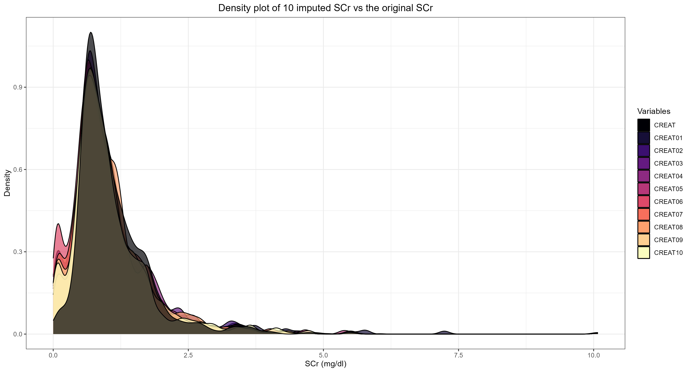

```{r}
#| label: setup
#| include: false
#| warning: false
knitr::opts_chunk$set(echo = TRUE)
library(dplyr)
library(here)
library(flextable)
library(ftExtra)
library(equatags)
```

```{=latex}
\begin{landscape}

\section*{Supplementary Figures}
\addcontentsline{toc}{section}{Supplementary Figures}
\phantomsection

\vspace{1em}
\begin{suppfig}

\includegraphics[width=7.01in,height=4.96in]{../../checklist-ijaa/Artwork/figures+captions/supp/figs1-obs_vs_imp_violin.png}

\caption{Violin plot showing the distribution of 10 imputed sets of serum creatinine values and the observed one.}

\end{suppfig}
\end{landscape}
```

::: landscape
::: {#figs-fluco-mi-scr-density}
{fig-align="left" width="8.18in" height="5.79in"}

Density plot showing the distribution of 10 imputed sets of serum creatinine values and the observed one.
:::
:::


